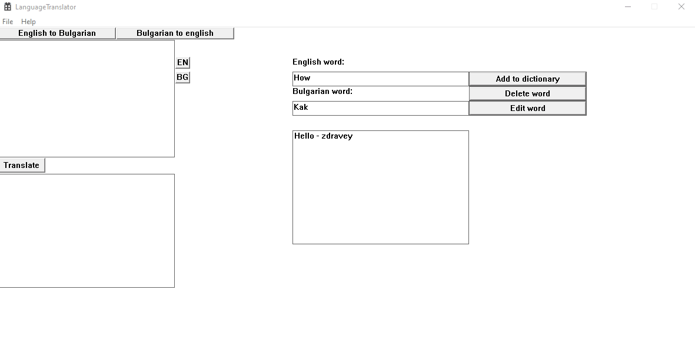
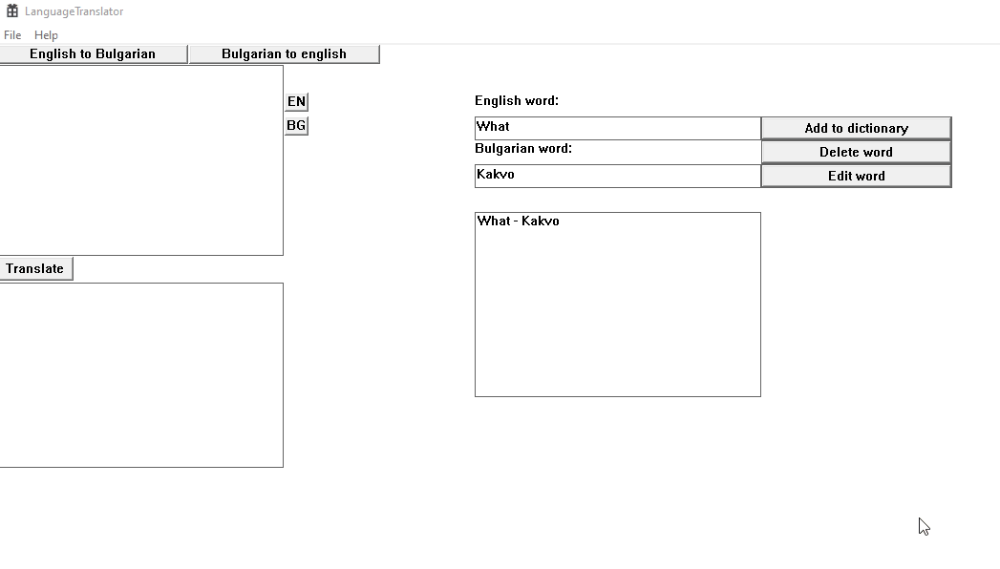

# Translator
  ### ✨ Setup:
   - Just install the program and enjoy it.
   - If you have some problem with _CRT_SECURE_NO_WARNINGS you have to do these few steps:
   * Because of wcscpy you have to do these steps:
   * Mark all the desired projects in solution explorer.
   * Press Alt - F7 or right click in solution explorer and select "Properties"
   * Configurations:All Configurations
   * Click on the Preprocessor Definitions line to invoke its editor
   * Choose Edit...
   * Copy "_CRT_SECURE_NO_WARNINGS" into the Preprocessor Definitions white box on the top
  ### How to use:
   - Add some words in the dictionary
    

   - Translate a word from en-bg/bg-en
    

  
  
